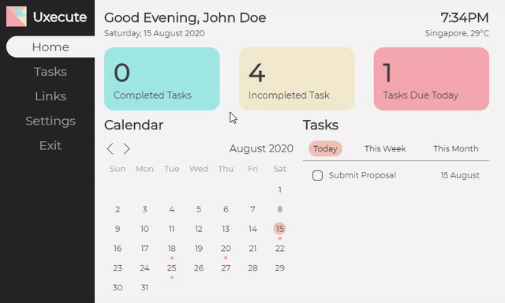

<h1>
     
    Uxecute Productivity Application
</h1>

## Overview
Uxecute Productivity Application (2020 Summer Side Project)

>Uxecute is a productivity application that allows users to keep track of task with deadlines and bookmark websites which can be easily access later using keyboard shortcuts.


## Motivation (Developer's Dairy)

Currently, I have just finished my second year of university in SMU(Singapore Management University). During my
first year in SMU, I've made about 2 similar applications as the one I've created here. They all function the same
whereby the solution is a dashboard-like application where it tells the time and weather and also features a todo list to manage tasks I do from day to day. 

However, from the 2 I've have made previously there was only one that I use regularly everyday which was a chrome
extension (Not fully developed) that I set as the default homepage for my chrome browser. During the summer of 2020, I really wanted to create and complete a desktop application that can intergrate with my everyday tasks.

This is where I stumbled across Electron JS which allows me to use my Javascript knowledge to build cross platform desktop apps. After, following several tutorials on Youtube, I knew that this was what I needed to create my ideal application.


> Why a desktop application?

Although there wasn't any issues with the previous 2 application. It wasn't very efficient when I was using them. This was because they were both web applications that required me to open my browser before use. Having a desktop application meant that I could have it run in the background and easily access it with a keyboard shortcut.

>  why fixed the application screen size to 800 x 480?

800 x 480 resolution is special because it is the exact screen size of a mini LCD screen for a raspberry pie. I had bought one of these screens previously and thought it would be a good idea to build an application around it. I could easily carry around the screen and connect it to my laptop. This way i could always have the home dashboard view at the corner of my eyes.

## Tech Stack

<div class="teckstack__container">
    <div class="column">
        <h3>Desktop Application</h3>
        <a target="_blank" href="https://www.electronjs.org/">
            <div class="card blue">
                <div class="content">Electron JS</div>
            </div>
        </a>
        <a target="_blank" href="https://vuejs.org/">
            <div class="card orange">
                <div class="content">Vue JS</div>
            </div>
        </a>
        <a target="_blank" href="https://weatherstack.com/">
            <div class="card red">
                <div class="content">Weather Stack</div>
            </div>
        </a>
    </div>
    <div class="column">
        <h3>Backend API</h3>
        <a target="_blank" href="https://nodejs.org/en/">
            <div class="card yellow">
                <div class="content">NodeJS</div>
            </div>
        </a>
        <a target="_blank" href="https://expressjs.com/">
            <div class="card red">
                <div class="content">Express</div>
            </div>
        </a>
        <a target="_blank" href="https://mongoosejs.com/">
            <div class="card blue">
                <div class="content">Mongoose</div>
            </div>
        </a>
        <a target="_blank" href="https://www.mongodb.com/">
            <div class="card orange">
                <div class="content">MongoDB</div>
            </div>
        </a>
    </div>
</div>

## Functionalities
### Home Dashboard



##### Date, Time & Weather
- Displays the current date, time and weather conditions based on the user's country.
- Weather data is drawn from the Weather Stack API.
- User's country is saved in the database and drawn when the user logs into the application.
  
##### Calendar
- Calendar built from scratch. Entire Calendar consists of two vue components which are Calendar.vue (Parent) and Calendarday.vue (Child).
- Each of the Calendar Day render will display a dot under its date if there are existing tasks that are completed that day(Green dot) or any tasks that have deadlines on that day(Red dot).
- Each Calendar Day can be clicked which will trigger the Task Widget on the right to display the tasks related to that day.

##### Task Widget
- Displays the Tasks based on the active tab (Today, This Week & This Month)
  - This Month
    - Displays all the tasks that have deadlines in the current month
  - This Week
    - Display all the tasks that have deadlines in the current week.
  - Today or Specified Date from Calendar Component
    - If specified date is today, display tasks that have deadlines today.
    - If specified date is in the past, display tasks that have been completed that day.
    - If specified date is in the future, display tasks that have deadlines that day.
___

### Tasks Tab


##### Display Tasks
- Displays existing tasks created by the user. Tasks are separated where incompleted tasks are rendered at the top and completed task at the bottom.

##### Add/Delete Tasks
- Adding of tasks will be completed in a pop-up modal. Users will have to indicate a task description and a deadline.
  - The indication of deadline is done using ```<input type="date">``` thus users wont have to worry about the formatting of the date string. (Not captured in the GIF.)
- Deleting of tasks can be done in the list by hovering on a existing task and clicking the cross emoji.
  
##### Archived Completed Tasks
- (To Be Updated)
___

### Links Tab


##### Display Links
- Displays existing links created by the user.
- Users can click on the 'cards' which will open the default browser on the system and direct the user to the site.
  
##### Add/Update/Delete Links
- Adding of links will be completed in a pop-up modal. Users will have to indicate a name, url and icon for the link.
    - Icons can be text instead of emojis.
- Editing and deleting existing links can be done by right clicking on the 'card' which will show buttons for each action.
  - Editing will be done in a similar modal as the adding a new link.
  - Deleting will be done instantly by clicking on the delete icon without confirmation.

##### Keyboard Control
- Users can access the links tab using the keyboard without having to use the mouse
  - *Note that the application should be open for the keyboard shortcuts to work*
  - "Ctrl + windows + z" will set focus the the entire Uxecute application
  - "Tab" will used to shift between the Navbar items and "Enter" will open that specific screen/slide
  - Users can then use the arrows keys to navigate between the Link 'cards' and "Enter" will open the links in the default browser.

## Backend API Reference
#### api/links [GET]
- Get all existing links based on email sent in request query.

#### api/links [POST]
- Create a new link for a user based on link object sent in request body.

#### api/links/{link_id} [PATCH]
- Update an existing link based on ```{link_id}``` and link parameters sent in request body.

#### api/links/{link_id} [DELETE]
- Delete an existing link based on ```{link_id}```.
  
#### api/tasks [GET]
- Get all existing tasks based on email sent in request query.

#### api/tasks [POST]
- Create a new task for a user based on link object sent in request body.

#### api/tasks/{task_id} [PATCH]
- Update an existing task based on ```{task_id}``` and task parameters sent in request body.

#### api/tasks/{task_id} [DELETE]
- Delete an existing task based on ```{task_id}```.

#### api/users/login [POST]
- Return user data based on email and password sent in request body.

#### api/users [POST]
- Create a new user based on the user object sent in request body.

#### api/users/{user_email} [PATCH]
- Update an existing user's settings based on ```{user_email}``` and user parameters sent in request body.

## Installation (Serve Locally, Build)
#### Desktop Application (Windows)
> Make sure to include your own Weather Stack API Key in Uxecute-Application/main.js

> If you have deployed the backend, make sure to also include the deployed link in Uxecute-Application/main.js

```batch
# Running on Localhost
cd Uxecute-Application
npm start

# Build
cd Uxecute-Application
npm run package-win
```

#### Backend API
> Make sure to include your own MongoDB connection string in Uxecute-Backend/app.js

> If you have deployed the backend, make sure to also include the deployed link in Uxecute-Backend/server.js

```batch
# Running on Localhost
cd Uxecute-Backend
npm start
```